<!-- ░░░░░░░░░░░░░░░░░░░░░░░░░░░  KUBETOFU  ░░░░░░░░░░░░░░░░░░░░░░░░░░░ -->

<div align="center">

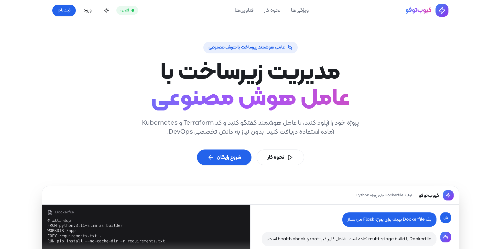

<h1>🧊 KubeTofu — <em>The Deep Cloud Agent</em></h1>

### Talk to your infrastructure. In plain language. It plans, prices, secures, and ships.

**KubeTofu** is a deep‑agentic Infrastructure‑as‑Code platform — think **Cursor, but for your cloud**.
Describe what you want in natural language and a team of specialized AI agents
analyzes your project, generates Terraform / Kubernetes / Dockerfiles, scans for security issues, estimates real
cloud costs, and — with your approval — deploys it for real.

<br>

[](LICENSE)
[](https://python.org)
[](https://djangoproject.com)
[](https://nextjs.org)

[](https://langchain-ai.github.io/langgraph/)
[](https://anthropic.com)
[](https://opentofu.org)
[](https://kubernetes.io)

🌐 **English** &nbsp;·&nbsp; [فارسی](README.fa.md)

</div>

---

## 📖 Table of Contents

- [Why KubeTofu](#-why-kubetofu)
- [At a Glance](#-at-a-glance)
- [System Architecture](#-system-architecture)
- [See It In Action](#-see-it-in-action)
  - [The Landing Experience](#the-landing-experience)
  - [The Agent Workspace](#the-agent-workspace)
  - [Bring Your Own Project](#bring-your-own-project)
  - [Generate Real Infrastructure](#generate-real-infrastructure)
  - [Provision & Price the Cloud](#provision--price-the-cloud)
  - [Execute, Diagnose & Research](#execute-diagnose--research)
  - [Govern Your Estate](#govern-your-estate)
- [The Deep Agents](#-the-deep-agents)
- [The Tool Suite](#-the-tool-suite-180)
- [Quick Start](#-quick-start)
- [The CLI](#-the-cli)
- [API Reference](#-api-reference)
- [Configuration](#-configuration)
- [Project Structure](#-project-structure)
- [Research & Evaluation](#-research--evaluation-dpiac)
- [Roadmap](#-roadmap)
- [License](#-license)

---

## 💡 Why KubeTofu

Infrastructure work is slow, error‑prone, and gate‑kept behind DevOps expertise. KubeTofu collapses that gap:
you speak intent, and a **deep agent** — an LLM reasoner wrapped in memory, tools, guardrails, and human approval —
does the engineering.

| | Traditional IaC | **KubeTofu** |
|---|---|---|
| **Interface** | HCL, YAML, `kubectl` | 🗣️ Natural language (فارسی / EN) |
| **Author** | You, by hand | 🤖 A fleet of specialized agents |
| **Security** | Bolt‑on, later | 🛡️ In‑loop, every plan |
| **Cost** | Surprise at month‑end | 💰 Estimated **before** you deploy |
| **Safety** | `terraform apply` and pray | ✅ Human‑in‑the‑loop approval gate |
| **Scope** | One cloud, one file | ☁️ Multi‑cloud, project‑aware |

> **KubeTofu** understands infrastructure requests in natural language and replies
> with production‑grade IaC — a first‑class experience for the Iranian developer community, and fully bilingual.

---

## ✨ At a Glance

<p align="center">
  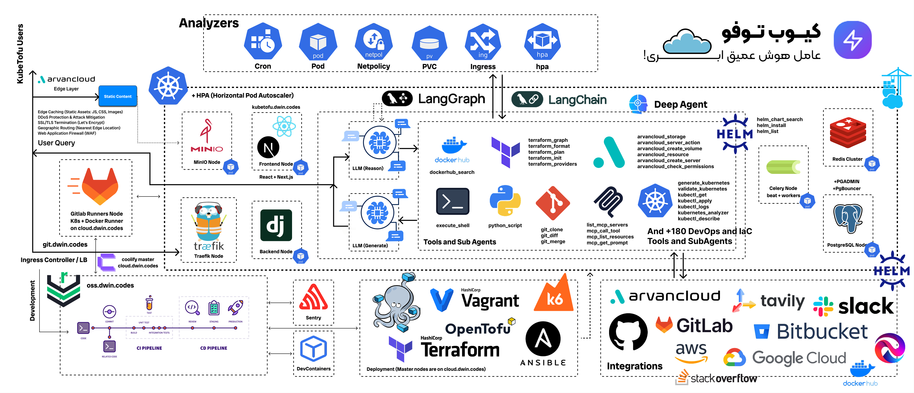
</p>
<p align="center"><sub><b>The whole platform on one canvas</b> — edge layer, frontend/backend nodes, the LangGraph &amp; LangChain deep‑agent brain, 180+ tools & sub‑agents, multi‑cloud fabric, CI/CD, and observability.</sub></p>

- 🧠 **Deep Agentic Core** — LangChain tool‑calling agents orchestrated by **LangGraph** state machines and a `Conductor`.
- 👥 **9 specialized agents** — Planner, Security, Cost, Deployment, Diagnostician, Research, Monitoring, Evaluator, Project Analyzer.
- 🧰 **180+ DevOps & IaC tools** — Terraform/OpenTofu, Kubernetes, Docker, Helm, Git, shell sandbox, web search, MCP, and more.
- ☁️ **Multi‑cloud** — ArvanCloud (first‑class), AWS, GCP, Azure.
- 🧩 **Project‑aware** — upload a repo (or import from GitHub / GitLab / Bitbucket) and get IaC tailored to *your* stack.
- 🔒 **Guardrails** — command safety checker, sandboxed execution, and a human approval gate before anything real happens.
- ⚡ **Live streaming UI** — a Gemini‑style chat that shows every thought, tool call, and sub‑agent in real time.
- 🧠 **Persistent memory** — ChromaDB + FAISS vector memory across sessions.

---

## 🏛 System Architecture

KubeTofu is a clean three‑tier system: a **Next.js** streaming frontend, a **Django + Channels** API gateway, and a
**deep‑agent core** that reasons with an LLM, remembers with a vector store, calls tools, and asks for human approval
before touching real infrastructure.

<p align="center">
  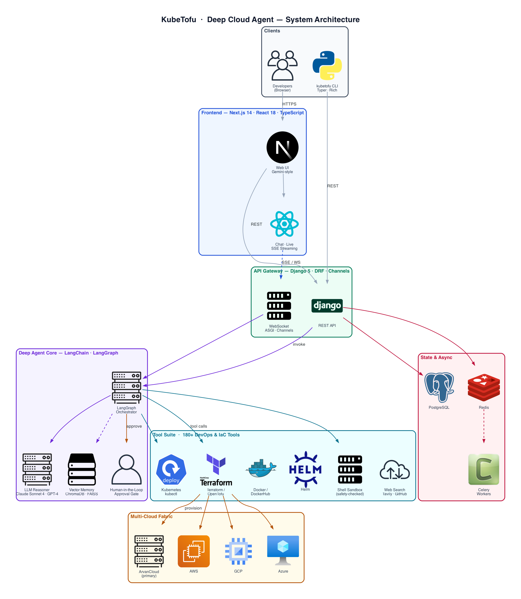
</p>
<p align="center"><sub><b>Request path:</b> Browser / CLI → Next.js → Django (REST + WebSocket) → LangGraph Orchestrator → Tool Suite → Multi‑cloud, with PostgreSQL / Redis / Celery for state & async work.</sub></p>

### Multi‑Agent Orchestration

A single request is decomposed and routed to the right experts. Agents share a common vector memory and are held to
account by a safety checker and a human‑in‑the‑loop gate.

<p align="center">
  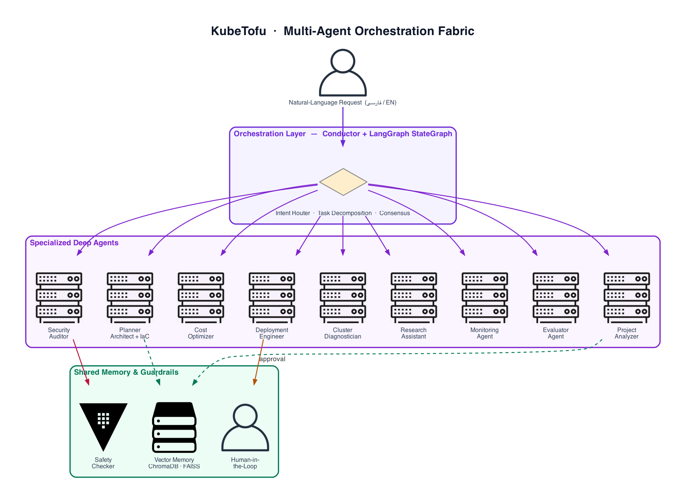
</p>
<p align="center"><sub><b>Conductor + LangGraph StateGraph</b> route intent across nine specialized deep agents, all grounded in shared memory and guardrails.</sub></p>

### The Autonomous Deploy Workflow

Deployments run through a LangGraph state machine: analyze → assess (security **∥** cost) → plan → **approval gate** →
deploy → verify. Drift or failures loop straight back to analysis.

<p align="center">
  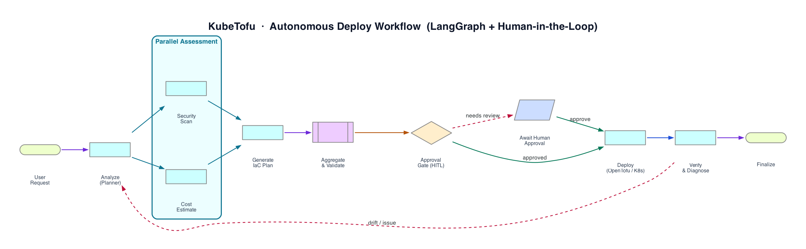
</p>
<p align="center"><sub>Nothing reaches your cloud without passing validation and (unless auto‑approved) an explicit <b>human approval</b>.</sub></p>

<table>
<tr>
<td width="50%" valign="top">

**Kubernetes‑native topology**

KubeTofu self‑hosts on Kubernetes: an ingress fronts the Next.js and Django pods, Celery workers run async jobs off
Redis, and Postgres / Redis / ChromaDB run as stateful services.

</td>
<td width="50%" valign="top">

**Multi‑cloud & integrations fabric**

One agent core drives many engines and providers — Terraform/OpenTofu, Ansible and Helm out to ArvanCloud, AWS, GCP
and Azure, with GitHub, GitLab, Slack, Prometheus, Vault and more wired in.

</td>
</tr>
<tr>
<td width="50%" valign="top">
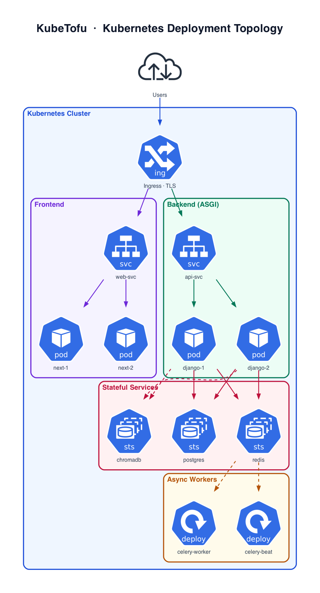
</td>
<td width="50%" valign="top">
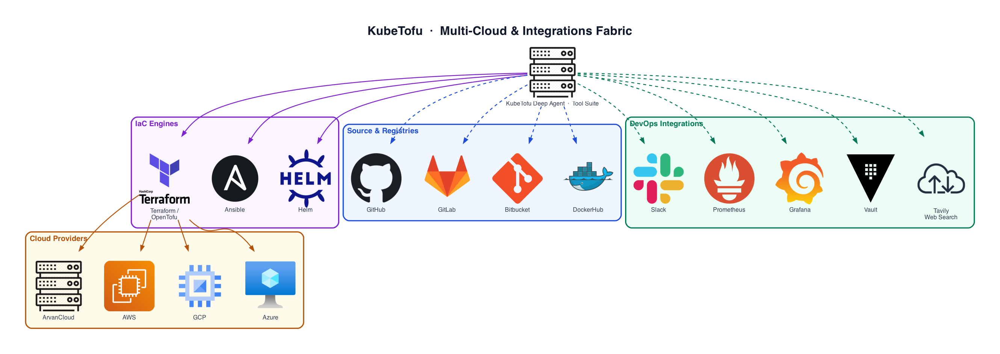
</td>
</tr>
</table>

---

## 🎬 See It In Action

### The Landing Experience

KubeTofu greets you with a modern, bilingual landing page that explains the value in three steps and shows the breadth
of supported stacks.

<p align="center">
  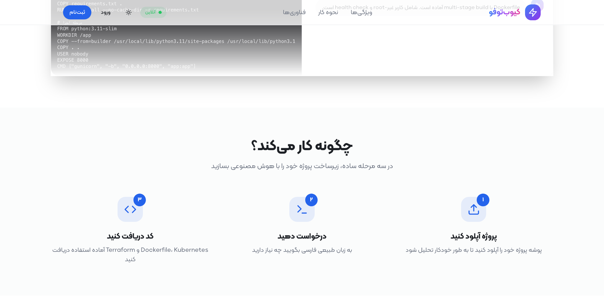
</p>
<p align="center"><sub><b>Three steps:</b> upload your project → ask in natural language → receive ready‑to‑use Dockerfile, Kubernetes &amp; Terraform.</sub></p>

<p align="center">
  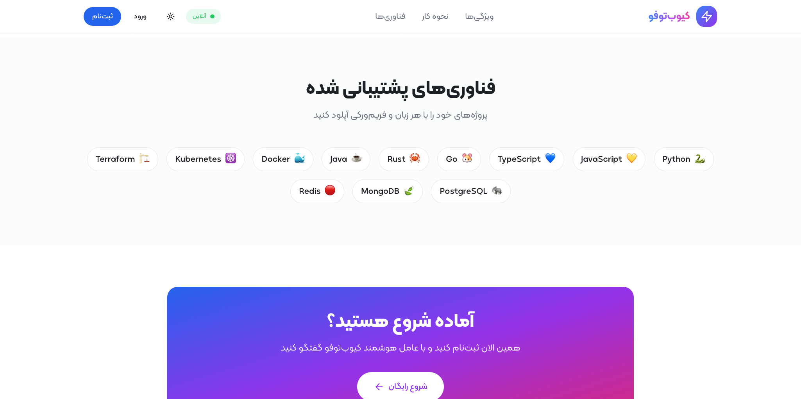
</p>
<p align="center"><sub>Upload projects in <b>any</b> language or framework — Terraform, Kubernetes, Docker, Java, Rust, Go, TypeScript, JavaScript, Python — with Redis, MongoDB and PostgreSQL auto‑detected.</sub></p>

### The Agent Workspace

Inside, KubeTofu feels like a chat‑first IDE for infrastructure: a live conversation on the left, your projects,
organizations, deployments and settings on the right, and quick actions to scaffold Terraform, Kubernetes or Dockerfiles
in a click.

<p align="center">
  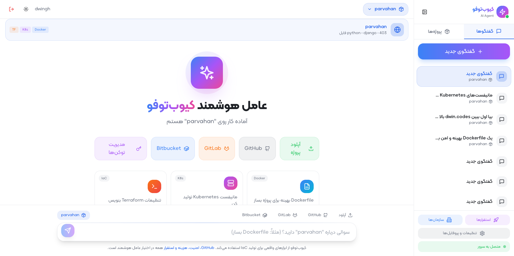
</p>
<p align="center"><sub>A Gemini‑style workspace: streaming answers, tool‑call timelines, conversation history, and one‑click quick actions — all bound to your active project.</sub></p>

### Bring Your Own Project

Point KubeTofu at your code and it analyzes structure, language, framework, dependencies and databases — then tailors
every suggestion to what it finds. Upload a folder, or import straight from your favorite forge.

<p align="center">
  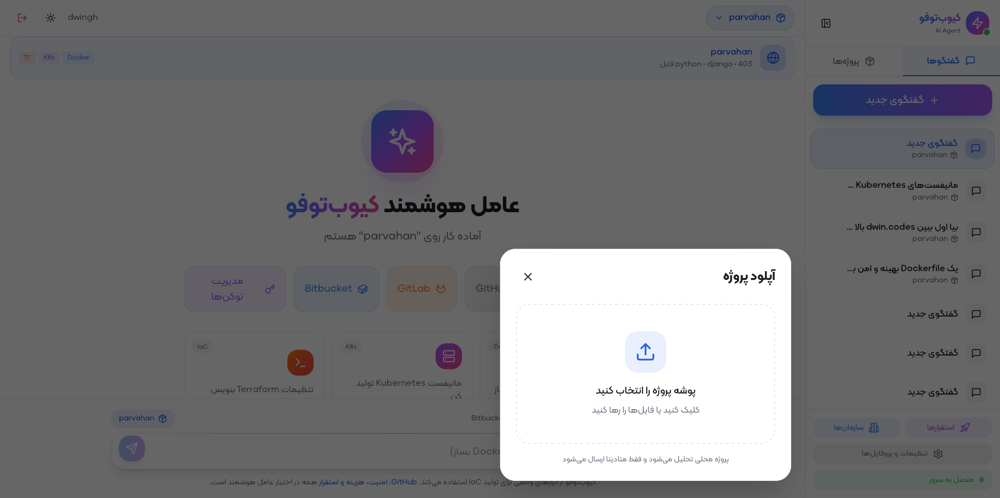
</p>
<p align="center"><sub>Local uploads are analyzed on‑device — <b>only metadata</b> is sent to the backend.</sub></p>

<table>
  <tr>
    <td align="center"><b>Import from GitHub</b></td>
    <td align="center"><b>Import from GitLab</b></td>
    <td align="center"><b>Import from Bitbucket</b></td>
  </tr>
  <tr>
    <td>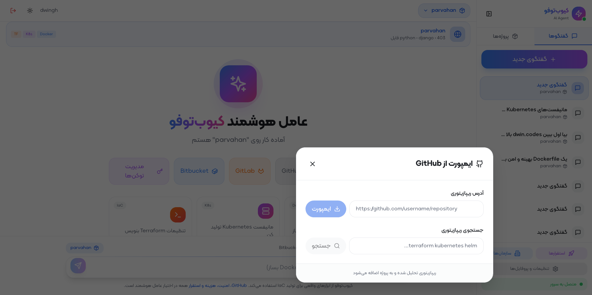</td>
    <td>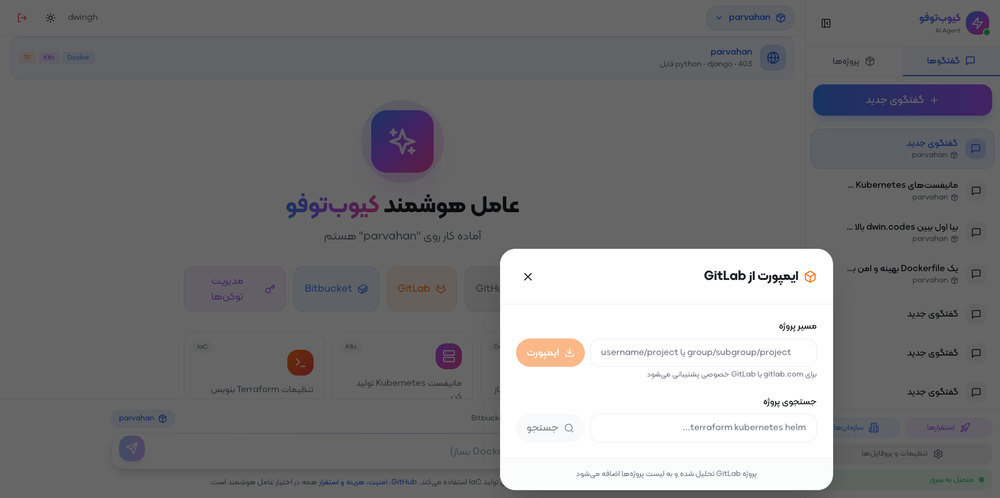</td>
    <td>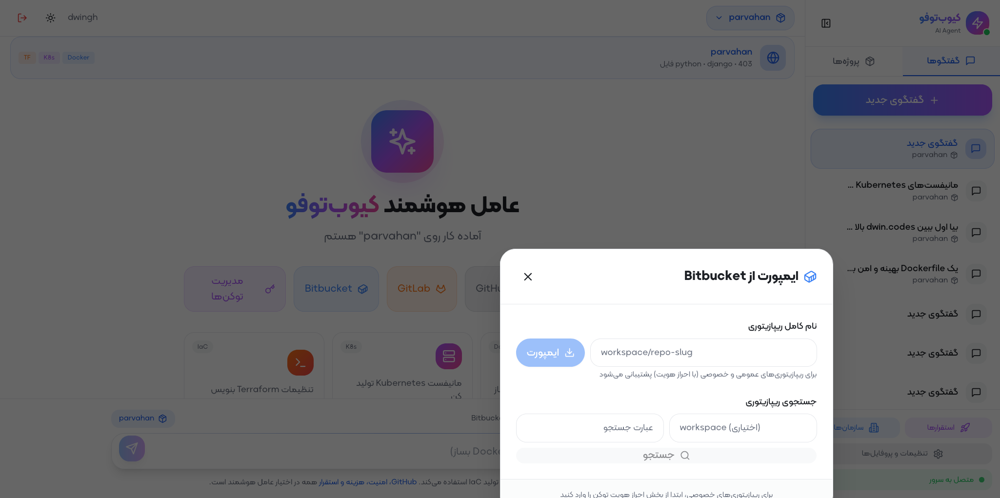</td>
  </tr>
</table>
<p align="center"><sub>Clone &amp; analyze a repository from GitHub, GitLab (incl. self‑hosted) or Bitbucket — public or private with a token.</sub></p>

Once imported, projects live in a tidy panel, and you can browse the analyzed source tree with a built‑in, syntax‑highlighted file viewer.

<table>
<tr>
<td width="42%" valign="top">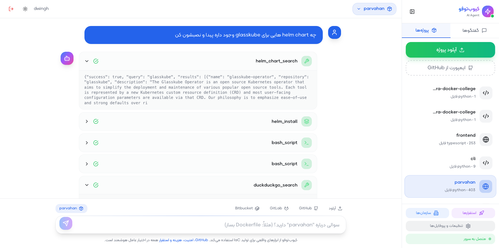</td>
<td width="58%" valign="top">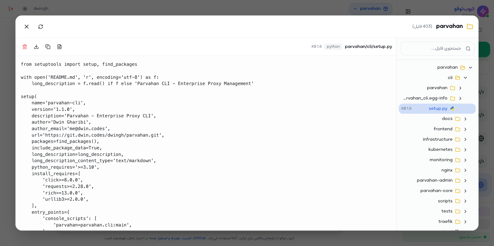</td>
</tr>
</table>
<p align="center"><sub><b>Left:</b> every project with detected language &amp; file count. &nbsp;<b>Right:</b> an in‑app code explorer for the analyzed repository.</sub></p>

### Generate Real Infrastructure

This is the heart of KubeTofu. Ask for what you need and watch the agent call the right tools — **generating and then
validating** every artifact so you get code that actually works.

<p align="center">
  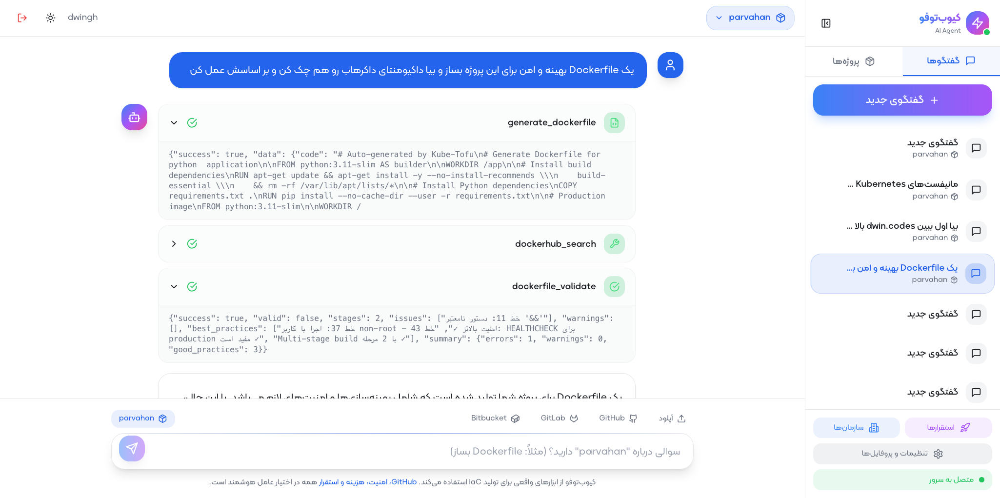
</p>
<p align="center"><sub><b>“Build me an optimized, secure Dockerfile.”</b> → <code>generate_dockerfile</code> → <code>dockerhub_search</code> → <code>dockerfile_validate</code>: multi‑stage build, non‑root user, HEALTHCHECK, best‑practice score.</sub></p>

<p align="center">
  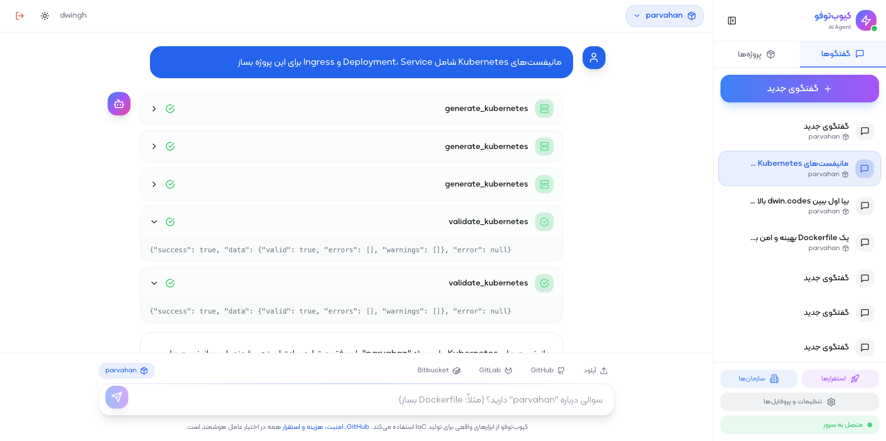
</p>
<p align="center"><sub><b>“Generate Kubernetes manifests with Deployment, Service &amp; Ingress.”</b> → <code>generate_kubernetes</code> → <code>validate_kubernetes</code> returns <code>{"valid": true}</code>.</sub></p>

<p align="center">
  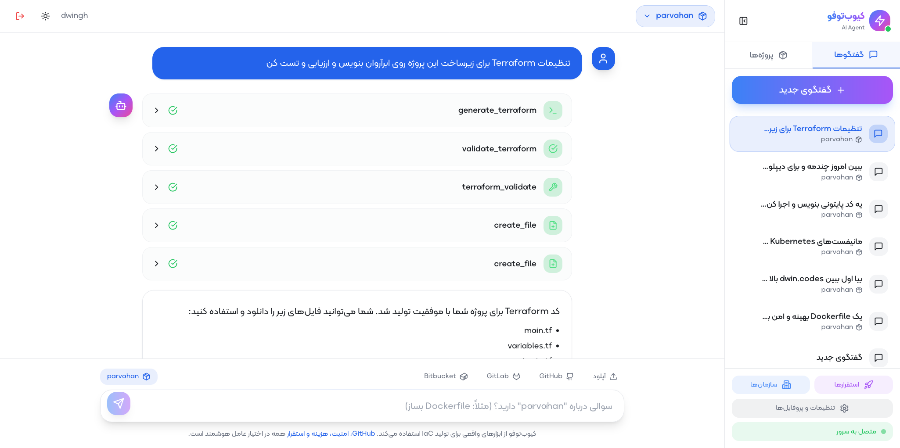
</p>
<p align="center"><sub><b>“Write Terraform for this project on ArvanCloud, validate &amp; test it.”</b> → <code>generate_terraform</code> → <code>validate_terraform</code> → writes <code>main.tf</code>, <code>variables.tf</code>, ready to download.</sub></p>

<p align="center">
  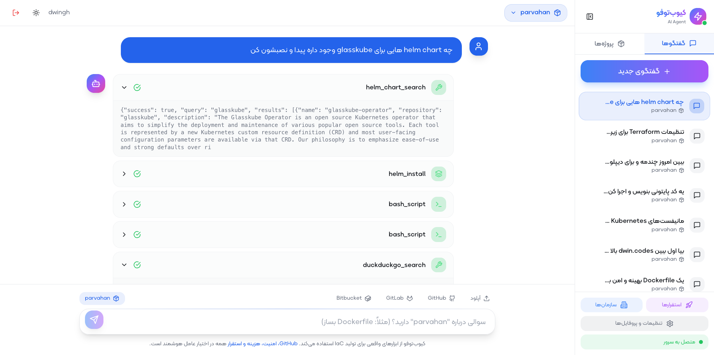
</p>
<p align="center"><sub><b>“Find and install a Helm chart for glasskube.”</b> → <code>helm_chart_search</code> → <code>helm_install</code> → verified with shell &amp; web search.</sub></p>

### Provision & Price the Cloud

KubeTofu doesn't just write code — it can talk to real cloud APIs. Here it checks permissions, lists sizes, and
**creates an actual server on ArvanCloud** — then reasons about the right flavor and the monthly bill in Toman, using a
live exchange rate.

<p align="center">
  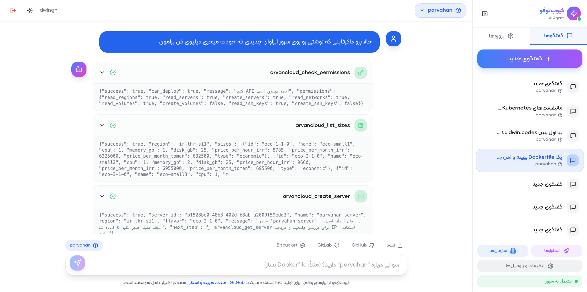
</p>
<p align="center"><sub><b>Real provisioning:</b> <code>arvancloud_check_permissions</code> → <code>arvancloud_list_sizes</code> → <code>arvancloud_create_server</code> spins up a live VM.</sub></p>

<table>
<tr>
<td width="50%" valign="top">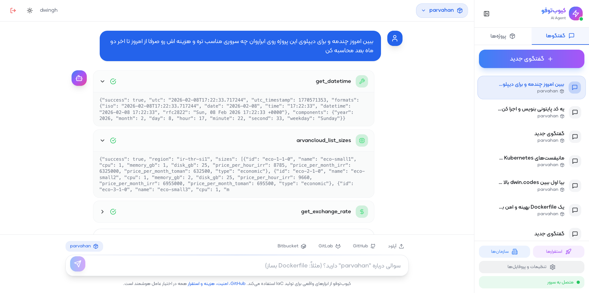</td>
<td width="50%" valign="top">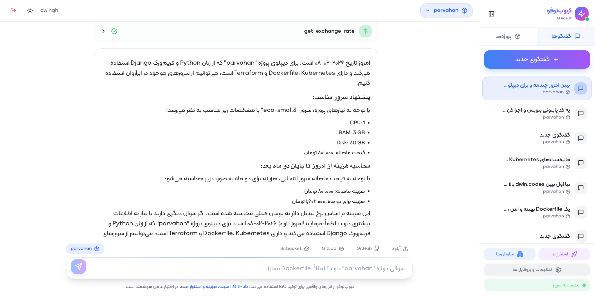</td>
</tr>
</table>
<p align="center"><sub><b>Cost, before you commit:</b> the agent combines <code>get_datetime</code>, <code>arvancloud_list_sizes</code> and <code>get_exchange_rate</code> to recommend a right‑sized flavor and project the two‑month cost — in real currency.</sub></p>

### Execute, Diagnose & Research

The deep agent is a full operator. It runs sandboxed shells and Python, diagnoses connectivity, pulls & runs
containers, clones repos, counts code, searches the web, and even browses the MCP tool ecosystem — all safety‑checked.

<table>
<tr>
<td width="50%" valign="top">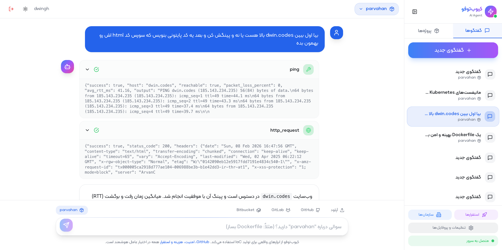</td>
<td width="50%" valign="top">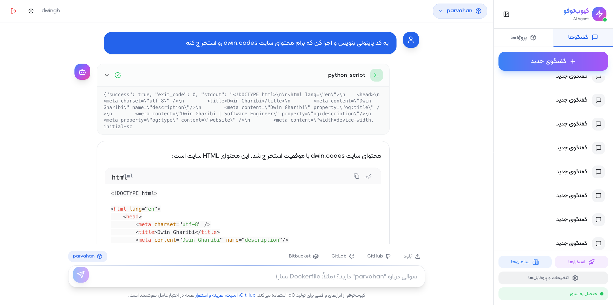</td>
</tr>
<tr>
<td align="center"><sub><b>Network diagnostics</b> — <code>ping</code> + <code>http_request</code> to check a host's health &amp; RTT.</sub></td>
<td align="center"><sub><b>Sandboxed Python</b> — <code>python_script</code> extracts and processes live web content.</sub></td>
</tr>
</table>

<table>
<tr>
<td width="50%" valign="top">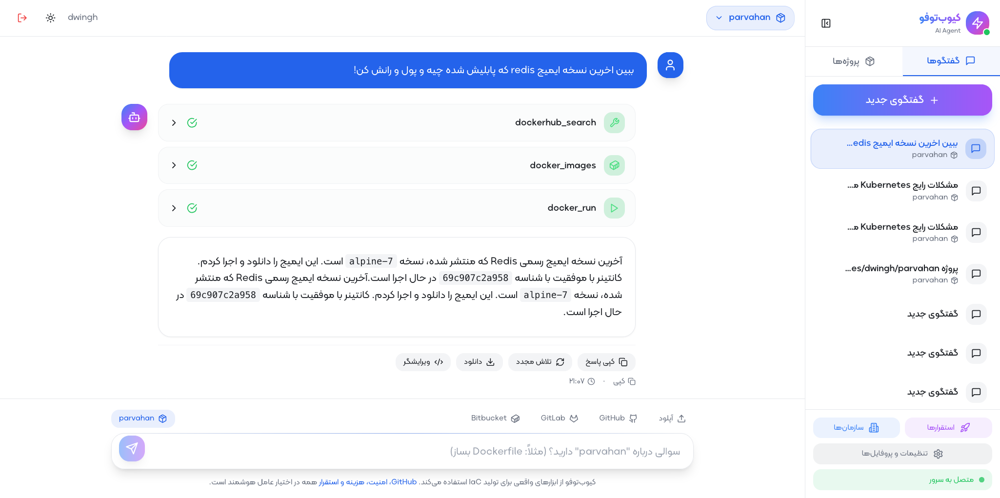</td>
<td width="50%" valign="top">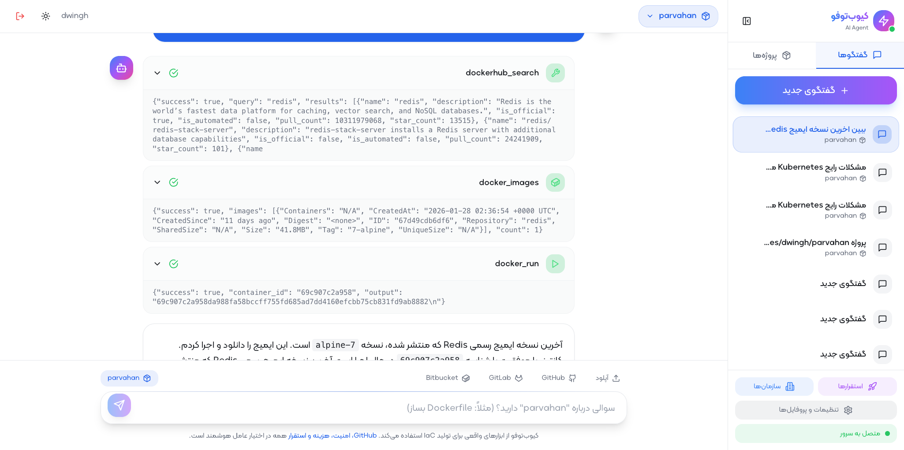</td>
</tr>
<tr>
<td align="center"><sub><b>Container ops</b> — <code>dockerhub_search</code> → <code>docker_images</code> → <code>docker_run</code> pulls &amp; runs Redis (alpine).</sub></td>
<td align="center"><sub><b>Image inspection</b> — sizes, digests and tags reasoned about inline.</sub></td>
</tr>
</table>

<table>
<tr>
<td width="50%" valign="top">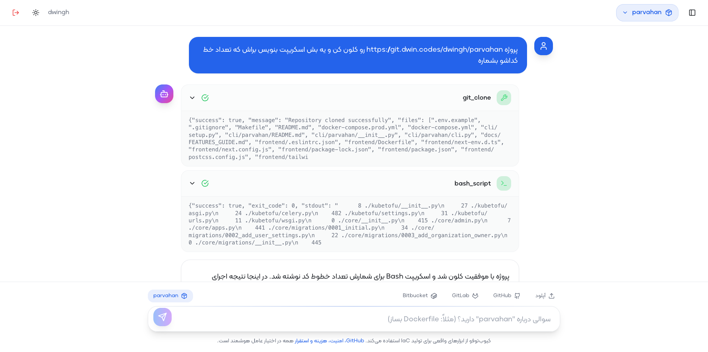</td>
<td width="50%" valign="top">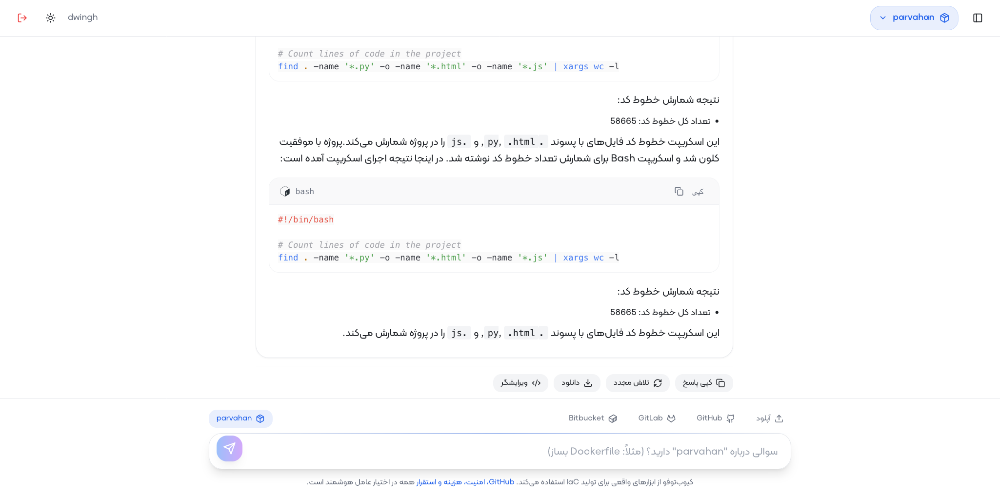</td>
</tr>
<tr>
<td align="center"><sub><b>Repo automation</b> — <code>git_clone</code> then a generated <code>bash_script</code>…</sub></td>
<td align="center"><sub>…that counts <b>58,665</b> lines of code across the project.</sub></td>
</tr>
</table>

<table>
<tr>
<td width="50%" valign="top">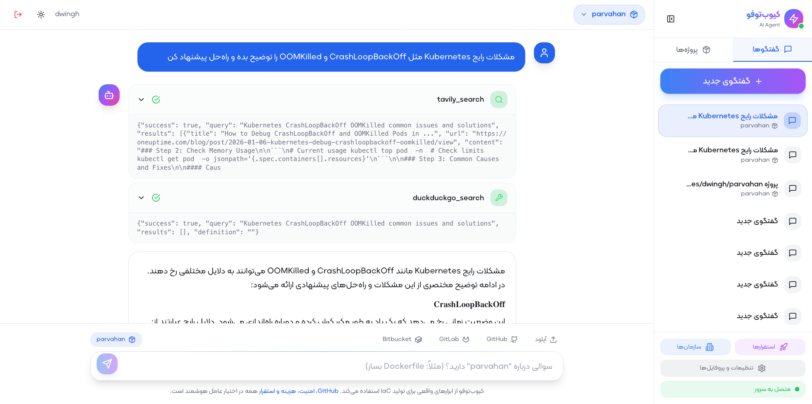</td>
<td width="50%" valign="top">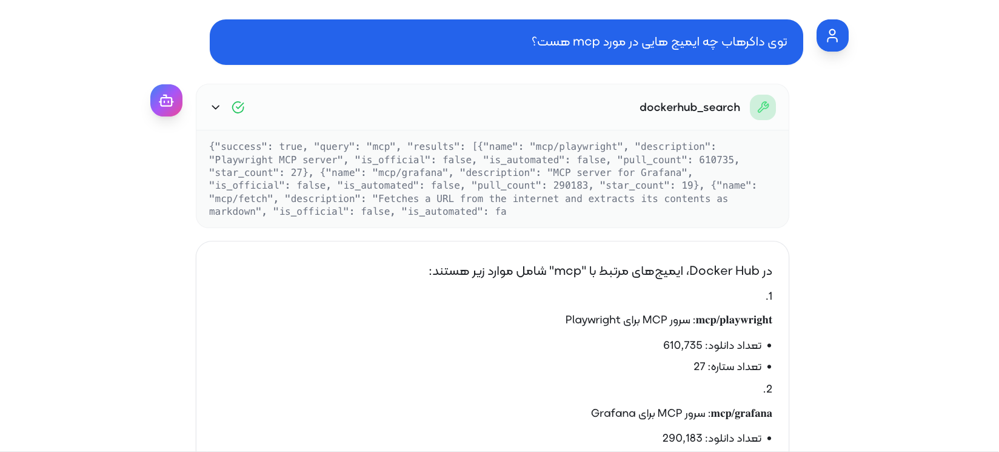</td>
</tr>
<tr>
<td align="center"><sub><b>Grounded research</b> — <code>tavily_search</code> + <code>duckduckgo_search</code> to solve <code>CrashLoopBackOff</code> / <code>OOMKilled</code>.</sub></td>
<td align="center"><sub><b>MCP‑aware</b> — discovers Model Context Protocol servers &amp; tools on Docker Hub.</sub></td>
</tr>
</table>

### Govern Your Estate

Organizations, workspaces, deployments, and cloud credentials are all first‑class. Track every rollout with its Jalali
timestamp and status, and store per‑provider API keys as reusable cloud profiles.

<table>
<tr>
<td width="50%" valign="top">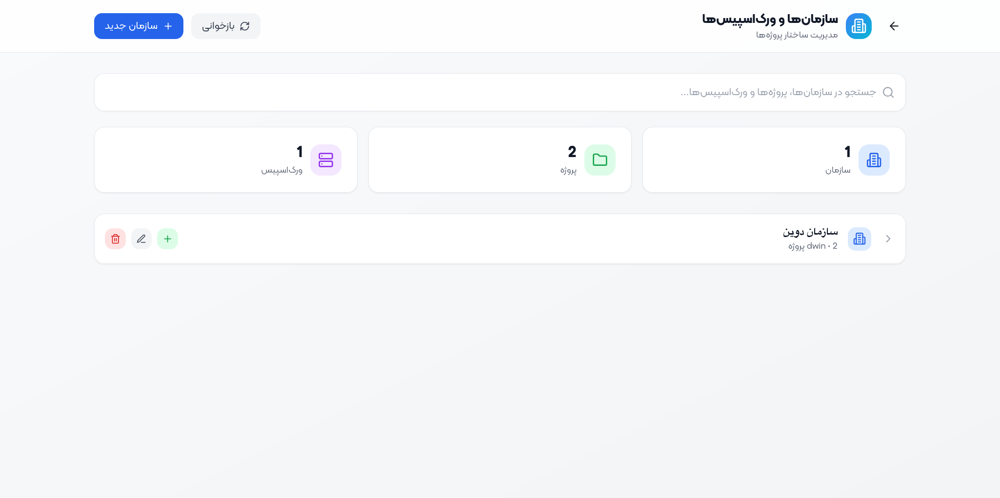</td>
<td width="50%" valign="top">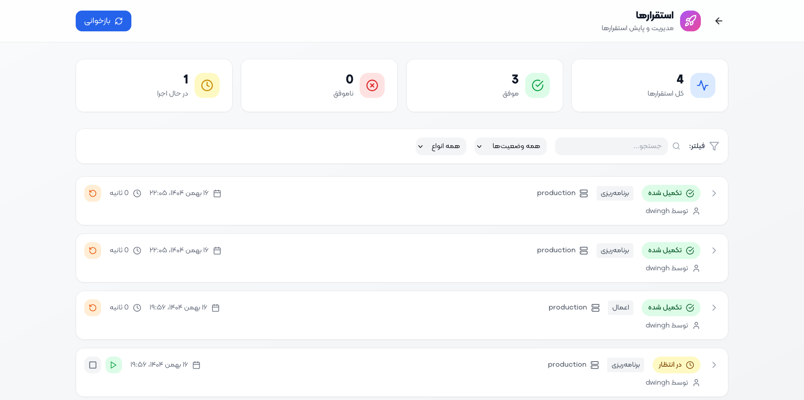</td>
</tr>
<tr>
<td align="center"><sub><b>Organizations &amp; workspaces</b> — structure projects across teams.</sub></td>
<td align="center"><sub><b>Deployments dashboard</b> — running / succeeded / failed, with full history.</sub></td>
</tr>
</table>

<table>
<tr>
<td width="50%" valign="top">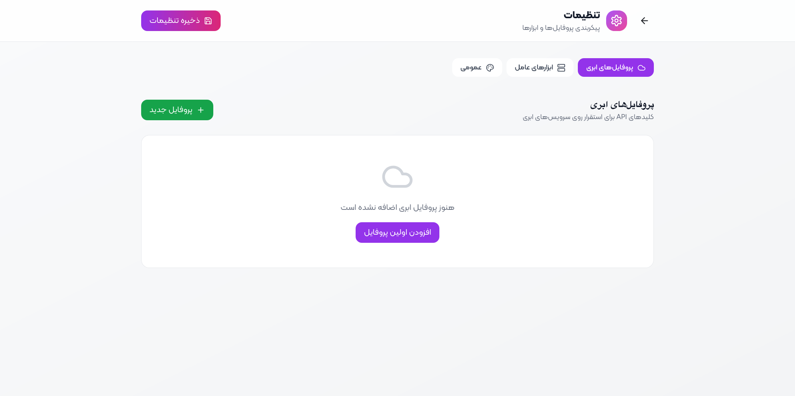</td>
<td width="50%" valign="top">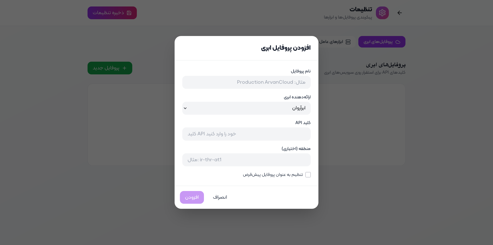</td>
</tr>
<tr>
<td align="center"><sub><b>Cloud profiles</b> — manage provider API keys for deployment.</sub></td>
<td align="center"><sub><b>Add a profile</b> — ArvanCloud, AWS, GCP or Azure, with region &amp; default.</sub></td>
</tr>
</table>

---

## 👥 The Deep Agents

Every agent is a `DeepAgent` — an LLM reasoner (Claude Sonnet 4 by default, or GPT) with its own scoped tools, memory,
temperature, and iteration budget. The `Conductor` and LangGraph orchestrate them into workflows.

| Agent | Specializes in | Signature tools |
|---|---|---|
| 🏗️ **Infrastructure Planner** | Cloud architecture, Terraform/K8s generation, cost‑aware, HA/DR design | `terraform_*`, `generate_*`, `hcl/yaml_validator`, search |
| 🛡️ **Security Auditor** | Vulnerability scanning, CIS/SOC2/HIPAA/PCI‑DSS compliance, secret detection *(temp 0.0)* | `terraform_validate`, `kubernetes_analyzer`, validators |
| 💰 **Cost Optimizer** | Real‑time pricing via provider APIs, right‑sizing, multi‑cloud comparison | `arvancloud_pricing`, `arvancloud_resource`, search |
| 🚀 **Deployment Engineer** | `tofu` init/plan/apply/destroy, K8s rollouts, zero‑downtime, rollback *(HITL)* | `terraform_*`, `kubectl` |
| 🩺 **Cluster Diagnostician** | K8sGPT‑style health analysis, `CrashLoopBackOff` / `OOMKilled` root‑cause | `kubectl`, `kubernetes_analyzer`, search |
| 🔎 **Research Assistant** | Docs & GitHub discovery, best‑practice synthesis *(no shell)* | `web_search`, `github_search` |
| 📈 **Monitoring Agent** | Health checks, metrics, anomaly signals | Prometheus, `kubernetes_analyzer` |
| ✅ **Evaluator Agent** | Config validation, quality scoring, consensus | validators |
| 📦 **Project Analyzer** | Language/framework/DB detection → per‑project IaC | `analyze_project_files`, `generate_*` |

**Orchestration workflows** (LangGraph + `Conductor`): `deploy` · `analyze` · `optimize` · `migrate` · `diagnose` —
with parallel fan‑out, dependency graphs, and multi‑agent consensus.

---

## 🧰 The Tool Suite (180+)

Agents act through a large, safety‑checked tool suite. A representative slice:

| Category | Tools |
|---|---|
| **IaC** | `terraform_init` · `terraform_plan` · `terraform_apply` · `terraform_validate` · `hcl_validator` (OpenTofu‑backed) |
| **Kubernetes** | `kubectl` · `kubernetes_analyzer` (pods, services, ingress, PVC, deployments) · `yaml_validator` |
| **Generators** | `generate_optimized_dockerfile` · `generate_kubernetes_manifests` · `generate_docker_compose` · Helm · Ansible · Vagrant |
| **Containers** | `dockerhub_search` · `docker_images` · `docker_run` · `helm_chart_search` · `helm_install` |
| **Cloud** | `arvancloud_pricing` · `arvancloud_resource` (servers, networks, volumes, floating IPs, security groups) |
| **Execution** | `shell_command` · `async_shell_command` · `python_execute` · `file_read` / `file_write` / `file_list` |
| **Research** | `web_search` (Tavily) · `github_search` · `duckduckgo_search` · `ping` · `http_request` |
| **Human‑in‑the‑loop** | `request_human_approval` · `ask_human` · `request_feedback` |
| **MCP** | `list_mcp_servers` · `mcp_call_tool` · `mcp_list_resources` · `mcp_get_prompt` |

> 🔒 **Guardrails.** Every shell command passes a `CommandSafetyChecker`: a blocklist (e.g. `rm -rf /`), dangerous‑pattern
> detection (`sudo`, `chmod 777`, `kill -9`, redirects to `/etc`), and an allowlist of trusted prefixes. Destructive
> actions require explicit human approval. Python runs in a sandbox with blocked imports.

---

## 🚀 Quick Start

### Prerequisites

```bash
node --version    # 18+
python --version  # 3.11+
docker --version  # optional, for containerized run
tofu --version    # OpenTofu (or Terraform)
```

### Option A — Docker Compose (recommended)

```bash
git clone https://github.com/<your-username>/kube-tofu.git
cd kube-tofu

# set your keys
export ANTHROPIC_API_KEY="sk-ant-..."
export OPENAI_API_KEY="sk-..."      # optional

docker compose up --build
# Frontend → http://localhost:3000
# Backend  → http://localhost:8000/api
```

This brings up the **frontend**, **backend**, **PostgreSQL** and **Redis** together.

### Option B — Run locally

```bash
# Backend
cd backend
pip install -r requirements.txt
python manage.py migrate
python manage.py runserver

# Frontend (new terminal)
cd frontend
npm install
npm run dev
```

---

## 🖥 The CLI

A Typer + Rich CLI (`kubetofu`) brings the deep agent to your terminal:

```bash
kubetofu init                                   # scaffold a new project
kubetofu chat                                   # interactive AI chat
kubetofu plan "a VPC with a private subnet and a web server" -p arvancloud
kubetofu apply                                  # deploy (asks for confirmation)
kubetofu status                                 # show live infrastructure
kubetofu destroy                                # tear down (asks for confirmation)
kubetofu agents                                 # manage AI agents
kubetofu config                                 # manage configuration
```

`plan` streams the agent's work — analyzing requirements, generating Terraform, running a security scan, and estimating
monthly cost — then prints the config, a cost table, and a security score.

---

## 🔌 API Reference

| Method | Endpoint | Description |
|---|---|---|
| `GET` | `/api/health/` | Health check |
| `POST` | `/api/chat/` | Chat with the deep agent |
| `POST` | `/api/chat/stream/` | **Streaming** chat (Server‑Sent Events) |
| `POST` | `/api/generate/` | Quick action — generate IaC |
| `POST` | `/api/security/scan/` | Quick action — security scan |
| `POST` | `/api/cost/estimate/` | Quick action — cost estimate |
| `POST` | `/api/diagnose/` | Quick action — diagnose a cluster |
| `POST` | `/api/projects/analyze/` | Analyze an uploaded project |
| `—` | `/api/sessions/` · `/api/projects/` · `/api/workspaces/` · `/api/deployments/` | REST resources |

<details>
<summary><b>Example — streaming chat with project context</b></summary>

```http
POST /api/chat/stream/
Content-Type: application/json

{
  "message": "یک مانیفست Kubernetes با ۳ رپلیکا برای این پروژه بساز",
  "session_id": "optional-uuid",
  "context": {
    "project_name": "my-app",
    "language": "python",
    "framework": "fastapi",
    "databases": ["postgresql"],
    "has_dockerfile": false,
    "has_kubernetes": false
  }
}
```

The response streams the agent's thoughts, each tool call, and the final answer as SSE events.
</details>

---

## ⚙️ Configuration

**Backend** (`backend/.env`):

```env
ANTHROPIC_API_KEY=sk-ant-...
OPENAI_API_KEY=sk-...
KUBETOFU_LLM_PROVIDER=anthropic          # or: openai
KUBETOFU_LLM_MODEL=claude-sonnet-4-20250514
TAVILY_API_KEY=tvly-...                  # web search
GITHUB_TOKEN=ghp_...                     # code search
ARVAN_API_KEY=...                        # ArvanCloud provisioning
DEBUG=True
```

**Frontend** (`frontend/.env.local`):

```env
NEXT_PUBLIC_API_URL=http://localhost:8000/api
NEXT_PUBLIC_WS_URL=ws://localhost:8000/ws
```

---

## 📁 Project Structure

```
kube-tofu/
├── frontend/                    # Next.js 14 · React 18 · TypeScript · Zustand
│   ├── app/                     # App Router (landing + chat workspace)
│   ├── components/              # UI (Radix + Tailwind + framer-motion)
│   └── lib/                     # API client (SSE), store, i18n (fa)
│
├── backend/                     # Django 5 · DRF · Channels · Celery
│   ├── agents/
│   │   ├── core/                # BaseAgent, LLM providers
│   │   ├── langchain/           # deep_agent · graph (LangGraph) · tools ·
│   │   │                        #   shell_tools · project_tools · memory ·
│   │   │                        #   human_in_loop · callbacks · prompts_fa
│   │   ├── orchestrator/        # conductor.py (multi-agent workflows)
│   │   └── specialized/         # planner · security · cost · deployment ·
│   │                            #   monitoring · evaluator
│   ├── generators/              # terraform · kubernetes · dockerfile · helm ·
│   │                            #   ansible · docker_compose · vagrant · unified
│   ├── providers/               # arvancloud (+ AWS / GCP / Azure via SDKs)
│   ├── integrations/            # github · gitlab · slack · prometheus · vault
│   ├── ml/ · learners/          # anomaly · clustering · ensemble learners
│   ├── evaluation/              # DPIAC benchmarks & metrics
│   ├── api/                     # views · urls · consumers (WS) · serializers
│   └── core/                    # models: Organization/Project/Workspace/…
│
├── cli/                         # kubetofu — Typer + Rich CLI
├── deployment/                  # docker/ + kubernetes/ manifests
└── docker-compose.yml
```

---

## 🔬 Research & Evaluation (DPIAC)

KubeTofu is also a research platform for **Deep‑agentic Infrastructure‑as‑Code (DPIAC)**, with a full
evaluation harness:

- **Novelty** — a deep multi‑agent architecture for IaC, NLU for infrastructure, LangGraph orchestration,
  human‑in‑the‑loop safety, and project‑aware generation.
- **Evaluation suite** — `benchmarks`, `dpiac_eval`, `metrics`, `ml_evaluation`, `security_cve`, `user_studies`,
  `cloud_testing`, `real_data`, `validators`.
- **Metrics** — Pass@k, Intent Alignment, Security Compliance, Cost Accuracy.
- **ML stack** — anomaly detection, classifiers, clustering, optimization, and weak/strong **ensemble learners**.

---

<div align="center">

<br>

**KubeTofu — talk to your infrastructure.**

Made with ❤️ by Dwin Gharibi and for the Amazing dev community.

<sub>Built with LangGraph · LangChain · Claude · Django · Next.js · OpenTofu · Kubernetes</sub>

</div>
